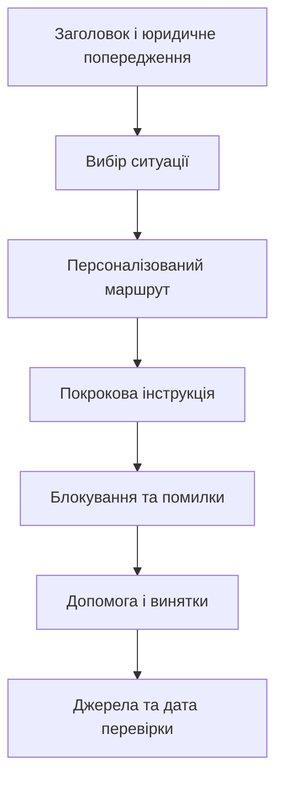
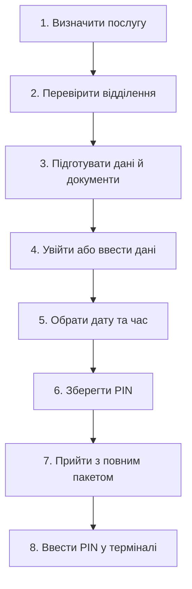
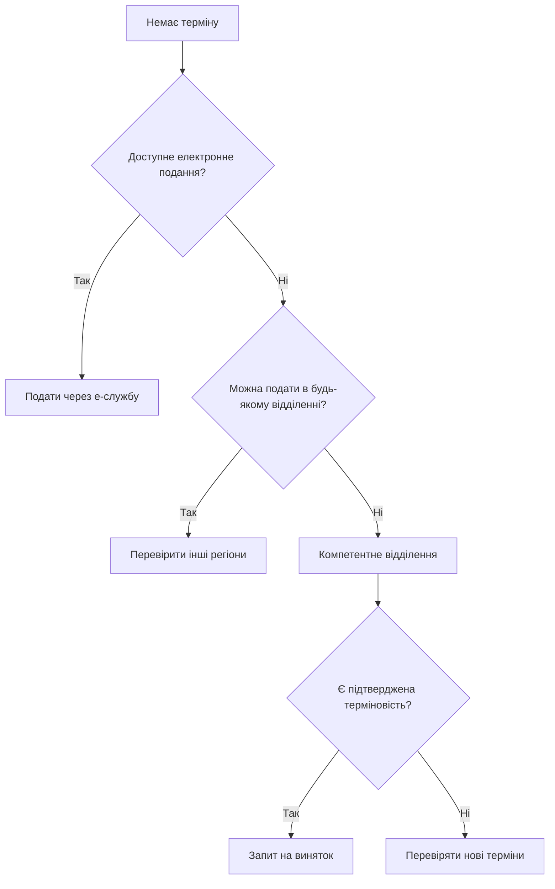

# Технічне завдання: інтерактивна інструкція з бронювання прийому в поліції у справах іноземців Словаччини

**Проєкт:** Slovakia Residence Guide  
**Мова першої версії:** українська  
**Стан правил і джерел:** 11.09.2026  
**Цільовий URL:** `/uk/tools/foreign-police-booking/`  
**Пріоритет:** High  
**Формат реалізації:** статична клієнтська сторінка без бекенду та без збирання персональних даних

---

## 1. Мета

Створити окрему односторінкову інструкцію, за допомогою якої іноземець може:

1. визначити правильний спосіб входу до системи резервування;
2. зрозуміти, яку послугу та відділення обрати;
3. підготувати дані й документи до бронювання;
4. пройти бронювання без типових помилок;
5. відрізнити відсутність термінів від технічної помилки або блокування;
6. отримати конкретний алгоритм дій у кожному проблемному випадку;
7. перейти тільки до офіційної системи МВС Словаччини.

Сторінка не повинна імітувати державну систему, бронювати терміни, збирати паспортні дані або створювати враження юридичної гарантії прийняття заяви.

## 2. Очікуваний результат

Після проходження інструкції користувач бачить персоналізовану пам’ятку:

- обрана послуга;
- допустиме відділення: будь-яке або лише компетентне за адресою;
- спосіб доступу: авторизований або неавторизований;
- перелік даних для форми;
- маршрутний чекліст документів;
- правила 15-денного ліміту та 60-денного блокування;
- дії при відсутності термінів або технічній помилці;
- кнопки «Перейти до офіційної системи», «Роздрукувати» та «Зберегти PDF».

## 3. Межі функціоналу

### 3.1. У межах MVP

- покрокова інструкція;
- інтерактивний вибір ситуації;
- матриця територіальної компетенції;
- таблиця блокувань і помилок;
- окремий сценарій «Немає термінів»;
- окремий сценарій «Мене заблоковано»;
- підстановка чекліста документів із наявних маршрутів сайту;
- офіційні джерела та дата перевірки кожного правила;
- друкована версія A4;
- локальне збереження лише неперсонального прогресу;
- українська локалізація.

### 3.2. Не входить до MVP

- автоматичне бронювання;
- пошук або моніторинг вільних термінів;
- обхід captcha, лімітів чи блокувань;
- збереження імені, паспорта, дати народження, адреси, PIN, email або телефону;
- надсилання звернень до МВС від імені користувача;
- гарантія, що конкретне відділення прийме заяву;
- юридична консультація щодо індивідуальної справи.

## 4. Основні користувацькі сценарії

| ID | Сценарій | Результат |
|---|---|---|
| U1 | Людина бронює прийом уперше | Отримує послідовність дій і переходить на офіційний портал |
| U2 | Людина не знає, яке відділення обрати | Бачить правило територіальної компетенції для своєї послуги |
| U3 | У календарі немає місць | Отримує допустимі альтернативи без твердження про «поломку» системи |
| U4 | Система не дозволяє створити новий запис | Визначає: 15-денний ліміт, 60-денний блок чи технічна помилка |
| U5 | Людина не може прийти | Бачить строк скасування, спосіб зберегти доказ і наслідки неявки |
| U6 | Немає PIN або підтвердження | Не вважає запис завершеним і отримує інструкцію для перевірки |
| U7 | Спливає документ або законний строк | Бачить попередження, що бронювання не зупиняє строк, і варіанти е-подання/винятку |

## 5. Інформаційна архітектура сторінки



### Послідовність блоків

1. Hero-блок.
2. Три критичні правила.
3. Майстер вибору ситуації.
4. Візуальний шлях бронювання.
5. Персональний результат.
6. Таблиця блокувань і помилок.
7. Алгоритм «Немає вільних термінів».
8. Картка звернення по технічну допомогу.
9. FAQ із 6–8 питань.
10. Офіційні джерела та дата перевірки.

## 6. Hero-блок

### Заголовок

**Як записатися до поліції у справах іноземців і не отримати блокування**

### Пояснення

«Оберіть свою ситуацію, перевірте відділення та підготуйтеся до бронювання. Ми не збираємо ваші персональні дані й переводимо вас лише на офіційний портал МВС Словаччини».

### Критичне юридичне повідомлення

> Бронювання терміну не є поданням заяви, не продовжує законне перебування і не зупиняє строк дії документів.

### Три постійно видимі попередження

| Маркер | Текст |
|---|---|
| `15 днів` | Одна людина — одне бронювання по всій Словаччині протягом 15 календарних днів; скасований запис також враховується |
| `12 годин` | Якщо не можете прийти, скасуйте запис не пізніше ніж за 12 годин |
| `60 днів` | Неявка або несвоєчасне скасування можуть спричинити блокування доступу на 60 календарних днів |

На мобільному ці правила показати трьома вертикальними картками, а не каруселлю.

## 7. Майстер вибору ситуації

Майстер не запитує персональних даних. Кожен крок містить кнопку «Не знаю» з коротким поясненням.

### Крок 1. Що потрібно зробити

- перший тимчасовий побит;
- продовження тимчасового побиту;
- зміна мети тимчасового побиту;
- постійний побит на п’ять років;
- довгостроковий побит;
- безстроковий постійний побит;
- національна віза;
- толероване перебування;
- реєстрація громадянина ЄС;
- документ для громадянина ЄС або члена його сім’ї;
- виготовлення/заміна картки побиту;
- засвідчення запрошення;
- інше.

### Крок 2. Чи є чинна електронна картка побиту

- так, картка чинна і BOK активований;
- картка є, але BOK не активований/не працює;
- картки немає;
- не знаю.

### Крок 3. Що відбувається зараз

- ще не відкривав систему;
- немає вільних термінів;
- система показує помилку;
- уже бронював протягом 15 днів;
- пропустив попередній прийом;
- не отримав PIN;
- запис скасувало відділення;
- інше.

### Результат майстра

Показати:

1. дозволений тип відділення;
2. рекомендований спосіб входу;
3. маршрутні документи;
4. відповідний сценарій вирішення проблеми;
5. кнопки переходу, друку і копіювання посилання.

## 8. Візуальний шлях бронювання



### Деталізація кроків

#### Крок 1. Визначити послугу

Показати обрану юридичну дію та посилання на відповідний маршрут сайту. Не використовувати «ВНЖ» як офіційну назву; у пошуку допустимі синоніми «ВНЖ», «побит», «дозвіл на проживання».

#### Крок 2. Перевірити відділення

Система сайту має повідомити, чи можна обрати будь-яке відділення або потрібне відділення за адресою.

#### Крок 3. Підготувати дані

Показати список без полів введення:

- ім’я та прізвище точно як у паспорті;
- дата народження;
- громадянство;
- номер проїзного документа;
- словацька адреса;
- власні email і телефон;
- повний комплект документів за маршрутом.

#### Крок 4. Обрати спосіб входу

| Спосіб | Умова | Горизонт бронювання |
|---|---|---|
| Авторизований | Чинна електронна картка, зареєстрований іноземець, активний шестизначний BOK, NFC/eIDENTITA або картрідер | До 60 днів |
| Неавторизований | Немає картки або послуга передбачена в неавторизованому режимі | До 40 днів |

Фраза «до 60/40 днів» описує горизонт календаря, а не гарантію наявності місць.

#### Крок 5. Обрати дату й час

Попередити користувача:

- перевірити категорію та життєву ситуацію;
- не використовувати VPN/proxy;
- не тримати форму відкритою надто довго;
- не відкривати паралельно кілька сесій;
- не створювати дублікати бронювання.

#### Крок 6. Зберегти підтвердження

Потрібно зберегти:

- PIN;
- дату й час;
- адресу відділення;
- строк чинності запису;
- email/SMS-підтвердження;
- screenshot або PDF.

#### Крок 7. Підготуватися до прийому

- перевірити повний комплект документів;
- перевірити чинність документів та законність перебування;
- при неможливості прийти скасувати запис щонайменше за 12 годин;
- прибути завчасно.

#### Крок 8. Отримати талон

У відділенні користувач вводить PIN у терміналі та отримує талон електронної черги.

## 9. Матриця територіальної компетенції

| Послуга | Допустиме відділення | Код правила |
|---|---|---|
| Перше надання тимчасового побиту | Будь-яке відділення | `ANY_DEPARTMENT` |
| Зміна мети тимчасового побиту | Будь-яке відділення | `ANY_DEPARTMENT` |
| Постійний побит на п’ять років | Будь-яке відділення | `ANY_DEPARTMENT` |
| Національна віза | Будь-яке відділення | `ANY_DEPARTMENT` |
| Толероване перебування | Будь-яке відділення | `ANY_DEPARTMENT` |
| Реєстрація громадянина ЄС/документ громадянина ЄС або члена сім’ї | Будь-яке відділення | `ANY_DEPARTMENT` |
| Продовження тимчасового побиту | За адресою заявника | `ADDRESS_DEPARTMENT` |
| Довгостроковий побит | За адресою заявника | `ADDRESS_DEPARTMENT` |
| Безстроковий постійний побит | За адресою заявника | `ADDRESS_DEPARTMENT` |
| Окреме виготовлення/заміна картки | За адресою заявника | `ADDRESS_DEPARTMENT` |
| Засвідчення запрошення | За адресою заявника | `ADDRESS_DEPARTMENT` |

Назви послуг і правила зберігати в даних, а не в компонентах. Перед кожним релізом звіряти з актуальними категоріями офіційної форми.

## 10. Блокування, скасування та помилки

### Обов’язкова класифікація

```ts
type BookingIssueStatus =
  | 'not-blocked'
  | 'limit-15d'
  | 'blocked-60d'
  | 'technical'
  | 'cancelled-by-authority';
```

### Матриця проблем

| Ситуація | Статус | Наслідок | Рекомендована дія |
|---|---|---|---|
| Немає вільних термінів | `not-blocked` | Місця недоступні, але доступ не заблокований | Перевірити дозволені інші відділення, е-подання, інституційний канал або виняток |
| Новий запис у межах 15 днів після попереднього | `limit-15d` | Нове бронювання може бути автоматично скасоване | Не створювати дубль; дочекатися завершення 15-денного періоду |
| Попередній запис скасовано користувачем | `limit-15d` | Скасований запис також враховується | Відлічувати строк від попереднього бронювання; при терміновості перевірити законні альтернативи |
| Неявка | `blocked-60d` | Блокування доступу до системи на 60 календарних днів | За помилки системи звернутися з доказами; при терміновості просити виняток; розблокування не гарантується |
| Скасування менш ніж за 12 годин | `blocked-60d` | Може прирівнюватися до неявки | Скасовувати завчасно та зберігати підтвердження |
| Неповний пакет і неприйняття заяви | `blocked-60d` | За оприлюдненим операційним попередженням візит може бути записаний як неявка | До прийому пройти маршрутний чекліст; у спорі зберегти докази фактичної явки |
| Дані не збігаються з паспортом | `technical` | Запис можуть не прийняти або скасувати | Використовувати точні дані людини, яка прийде особисто |
| Форма відкрита надто довго або дані помилкові | `technical` | Сесія завершується помилкою | Підготувати дані, закрити форму та почати заново |
| VPN/proxy/маскування IP | `technical` | Бронювання може не завершитися як підозріла сесія | Вимкнути засоби маскування та повторити через стабільне з’єднання |
| Немає PIN | `technical` | Немає надійного підтвердження завершення бронювання | Перевірити spam і контакти; зробити screenshot; звернутися до Call-центру |
| Не працює картка/BOK | `technical` | Авторизований режим недоступний | Перевірити картку, BOK, NFC/картрідер; неавторизований режим використовувати лише для доступної там послуги |
| Запис скасувало МВС/відділення | `cancelled-by-authority` | Користувач отримує email/SMS або повідомлення на сайті | Виконати офіційну інструкцію та уточнити вплив на 15-денний ліміт перед створенням дубля |

Для службового скасування не стверджувати, що 15-денний ліміт автоматично анульовано: оприлюдненого однозначного правила не знайдено. **Редакційна впевненість: 75%.**

## 11. Алгоритм «Немає вільних термінів»



### Електронне подання

Серед передбачених електронних дій показати:

- продовження тимчасового побиту;
- нову картку побиту;
- довгостроковий побит;
- безстроковий постійний побит.

Поруч зазначити: потрібні чинна активована картка та BOK; остаточну доступність користувач перевіряє на офіційному порталі.

### Інституційні канали

Окрему підказку показати для:

- стипендіатів;
- Erasmus/Erasmus+;
- докторантів;
- викладачів університетів;
- дослідників;
- працівників центрів спільних послуг;
- значних іноземних інвесторів.

Не обіцяти прямого запису. Запропонувати звернутися до університету, Словацької академії наук або відповідної організації.

### Запит на виняток

Показувати лише як можливість, а не право на гарантований термін. Типові підстави:

- неповноліття;
- похилий вік;
- стан здоров’я;
- документ або законний строк, що невдовзі спливає;
- інша доведена термінова обставина.

Чекліст звернення:

- ім’я та прізвище;
- громадянство;
- номер проїзного документа;
- вид і мета перебування;
- потрібна послуга;
- адреса у Словаччині;
- дата спливу документа або строку;
- пояснення терміновості;
- контактні дані;
- підтвердні документи;
- screenshot помилки або блокування.

## 12. Картка технічної допомоги

Текст картки:

> Call-центр МВС може допомогти з перевіркою технічної проблеми, але не створює і не скасовує бронювання.

Перед зверненням підготувати:

- ім’я та прізвище;
- громадянство;
- номер проїзного документа;
- вид/мету перебування;
- назву послуги;
- дату, час і відділення, якщо вже обрані;
- screenshot із повним текстом помилки;
- email і телефон із форми.

Сайт не повинен пропонувати вводити ці дані у власну форму.

## 13. Інтерфейс і компоненти

### 13.1. Компоненти

```text
BookingGuidePage
├── LegalNotice
├── CriticalRules
├── SituationWizard
├── BookingTimeline
├── PersonalizedSummary
├── DepartmentRuleCard
├── DocumentsChecklistLink
├── BookingIssuesTable
├── NoSlotsDecisionTree
├── SupportCard
├── BookingFaq
├── OfficialLinks
└── PrintActions
```

### 13.2. Поведінка

- Майстер працює без перезавантаження сторінки.
- Стан кодується в URL query/hash без персональних даних.
- Кнопка Back браузера повертає до попереднього кроку.
- Пряме посилання відкриває відповідний сценарій.
- Користувач може змінити будь-яку відповідь без повного скидання.
- Після зовнішнього переходу стан інструкції зберігається локально.
- Посилання на офіційний портал відкривається в новій вкладці з `rel="noopener noreferrer"`.

### 13.3. Візуальні статуси

| Статус | Колір | Іконка | Семантика |
|---|---|---|---|
| Інформація | синій | `info` | нейтральна інструкція |
| Увага | жовтий/бурштиновий | `triangle-alert` | ризик помилки |
| Блокування | червоний | `lock` | ліміт або blacklist |
| Доступна дія | зелений | `circle-check` | законний наступний крок |

Колір не може бути єдиним способом передавання значення.

### 13.4. Mobile

- ширина від 320 px;
- одна колонка;
- таблиця проблем перетворюється на картки;
- sticky-кнопка переходу не перекриває контент;
- touch target не менше 44×44 px;
- критичні правила не приховувати в акордеоні.

### 13.5. Друк/PDF

- формат A4;
- без меню, cookie-banner і декоративних елементів;
- персоналізований результат на першій сторінці;
- показувати повні URL офіційних джерел;
- дата формування та дата перевірки правил;
- не друкувати порожні секції.

## 14. Модель даних

```ts
type DepartmentRule = 'ANY_DEPARTMENT' | 'ADDRESS_DEPARTMENT' | 'VERIFY';

type BookingService = {
  id: string;
  titleUk: string;
  routeId?: string;
  departmentRule: DepartmentRule;
  authModes: Array<'authorized' | 'unauthorized'>;
  electronicSubmission?: boolean;
  officialCategoryLabel?: string;
  sourceUrl: string;
  reviewedAt: string;
};

type BookingIssue = {
  id: string;
  titleUk: string;
  status: BookingIssueStatus;
  trigger: string;
  effect: string;
  immediateActions: string[];
  escalation?: string;
  sourceUrl: string;
  reviewedAt: string;
  confidence: number;
};

type BookingRule = {
  id: string;
  value?: number;
  unit?: 'calendar-days' | 'hours';
  textUk: string;
  legalWeight: 'law' | 'official-rule' | 'operational-guidance';
  sourceUrl: string;
  reviewedAt: string;
  reviewStatus: 'verified' | 'lawyer-review' | 'outdated';
};
```

### Обов’язкові правила в даних

```ts
const bookingRules = {
  reservationFrequencyDays: 15,
  cancellationBeforeHours: 12,
  noShowBlockDays: 60,
  authorizedCalendarDays: 60,
  unauthorizedCalendarDays: 40,
};
```

Не дублювати ці числа в компонентах. Увесь інтерфейс має отримувати їх із одного джерела.

## 15. Логіка персоналізації

```ts
function buildBookingGuidance(input: WizardInput): Guidance {
  const service = getService(input.serviceId);
  const department = service.departmentRule;
  const authMode = selectAvailableAuthMode(service, input.cardStatus);
  const issue = input.issueId ? getIssue(input.issueId) : undefined;

  return {
    service,
    department,
    authMode,
    routeChecklistUrl: getRouteChecklist(service.routeId),
    warnings: getApplicableWarnings(issue),
    alternatives: getLawfulAlternatives(service, issue),
  };
}
```

Якщо даних недостатньо, результат повинен сказати «Потрібна перевірка», а не вгадувати.

## 16. Інтеграція з маршрутами сайту

На кожній маршрутній сторінці додати блок перед зовнішньою кнопкою:

1. «Перевірте документи» — відкриває чекліст маршруту.
2. «Перевірте відділення» — показує правило компетенції.
3. «Прочитайте правила бронювання» — deep link на цю інструкцію.
4. «Перейти до офіційної системи» — зовнішній URL МВС.

Параметри deep link:

```text
/uk/tools/foreign-police-booking/?service=temporary-first
/uk/tools/foreign-police-booking/?service=temporary-renewal&issue=no-slots
/uk/tools/foreign-police-booking/?issue=blocked-60d
```

Не передавати в URL ім’я, номер документа, адресу, PIN, email або телефон.

## 17. FAQ на сторінці

1. Чи є відсутність вільних дат блокуванням?
2. Чи можна створити декілька записів у різних містах?
3. Чи враховується скасований запис у 15-денний ліміт?
4. Що буде, якщо не прийти?
5. Що робити, якщо не отримано PIN?
6. Чи можна записати іншу людину?
7. Чи продовжує бронювання законне перебування?
8. Коли можна просити прийом поза системою?

Відповіді брати з тієї самої моделі правил, що й основні компоненти.

## 18. Приватність і безпека

- не створювати поля для паспортних чи контактних даних;
- не підключати сторонні session-replay інструменти на цій сторінці;
- не записувати в аналітику вільний текст;
- дозволена аналітика лише за неперсональними подіями: `wizard_started`, `service_selected`, `issue_selected`, `official_link_clicked`, `print_clicked`;
- не вбудовувати державний портал через `iframe`;
- зовнішній домен перевіряти за allowlist;
- не створювати функцій автоматичного оновлення, скрейпінгу слотів або обходу захисту порталу.

## 19. Доступність

- WCAG 2.2 AA;
- Lighthouse Accessibility не нижче 95;
- усі дії доступні з клавіатури;
- видимий focus;
- правильна ієрархія `h1–h3`;
- акордеони мають `aria-expanded` та `aria-controls`;
- повідомлення про зміну результату — через `aria-live="polite"`;
- підтримка `prefers-reduced-motion`;
- діаграми дублюються текстом;
- контраст тексту й інтерактивних елементів відповідає AA.

## 20. SEO

- `title`: «Запис до поліції у справах іноземців у Словаччині — інструкція»;
- `description`: «Як забронювати прийом, обрати відділення, зберегти PIN та діяти при блокуванні або відсутності термінів»;
- canonical URL без параметрів;
- FAQPage JSON-LD лише для FAQ, реально видимих на сторінці;
- `noindex` для URL із технічними параметрами не потрібний, якщо canonical налаштований правильно;
- зовнішні офіційні посилання повинні мати зрозумілий текст, а не «натисніть тут».

## 21. Оновлення правової інформації

- кожне правило має `reviewedAt`, `sourceUrl`, `reviewStatus`;
- `outdated` не допускається в production build;
- якщо правило не перевірено понад 90 днів, збірка показує warning;
- для критичних строків 12 годин, 15 і 60 днів встановити автоматичний тест значень;
- зміни не публікувати без перевірки офіційного або первинного джерела;
- матеріали соцмереж можна використовувати для виявлення питань, але не як єдину правову підставу;
- дата «Перевірено» видима поруч із джерелами.

## 22. Офіційні та допоміжні джерела

1. МВС Словаччини — система резервування:  
   https://www.minv.sk/?objednavaci-system-na-ocp=
2. МВС Словаччини — загальні правила:  
   https://www.minv.sk/?vseobecne-pravidla-rezervacneho-systemu-mv-sr=
3. МВС Словаччини — винятки:  
   https://www.minv.sk/?objednavaci-system-vynimky=
4. IOM Migration Information Centre — FAQ, оновлено 09.09.2026:  
   https://mic.iom.sk/en/contact/faq-en.html
5. IOM — відсутність термінів:  
   https://mic.iom.sk/sk/novinky/906-co-mozete-robit-v-pripade-nedostupnosti-terminov-na-cudzineckej-policii.html
6. EURAXESS Point SAV — авторизація, горизонти бронювання, 60-денний blacklist, оновлено 29.01.2026:  
   https://euraxesspoint.sav.sk/rezervacny-system-cudzineckej-policie-rozdelenie-dostupnosti-okruhu-situacii-pre-autorizovanych-a-neautorizovanych-cudzincov/
7. Пряшівський університет — скасування за 12 годин, неповний пакет, VPN/proxy, оновлено 27.08.2026:  
   https://www.unipo.sk/en/node/86603
8. Human Rights League — зміни правил резервування:  
   https://www.hrl.sk/sk/o-nas/aktuality/zmena-systemu-registracie-na-cudzineckej-policii

## 23. Тестування

### 23.1. Unit tests

- визначення правила відділення для кожної послуги;
- вибір авторизованого/неавторизованого режиму;
- значення 15 днів, 12 годин, 60 днів, 60/40 днів;
- формування попереджень;
- відсутність персональних даних у URL та localStorage;
- приховування `outdated` правил.

### 23.2. Integration tests

- маршрут сайту передає правильний `service`;
- майстер формує правильний результат;
- deep link відкриває потрібний сценарій;
- зовнішня кнопка веде на allowlisted офіційний домен;
- друк отримує персоналізований результат;
- FAQ використовує те саме джерело правил.

### 23.3. E2E-сценарії

1. Перше подання без картки → неавторизований режим → будь-яке відділення.
2. Продовження з карткою+BOK → авторизований режим → відділення за адресою.
3. Немає слотів для першого подання → перевірка інших регіонів.
4. Немає слотів для продовження → е-подання або компетентне відділення.
5. Попереднє бронювання було 7 днів тому → пояснення 15-денного ліміту.
6. Неявка → 60-денний блок, доказова ескалація та виняток без обіцянки розблокування.
7. Немає PIN → запис не позначається підтвердженим.
8. Службове скасування → рекомендація перевірити повідомлення й уточнити ліміт.
9. Клавіатурна навігація по всьому майстру.
10. Сторінка 320 px і друк A4 без втрати критичної інформації.

## 24. Критерії приймання

1. Користувач не більше ніж за два кліки визначає тип відділення.
2. Відсутність місць ніде не називається блокуванням.
3. Ліміт 15 днів і blacklist на 60 днів пояснені як різні механізми.
4. Перед переходом до державної системи видимі три критичні правила.
5. Для вибраної послуги показано правильний маршрутний чекліст.
6. На сторінці немає полів для персональних даних.
7. Жодні персональні дані не потрапляють у URL, аналітику або localStorage.
8. Усі зовнішні кнопки ведуть лише на перевірені офіційні адреси.
9. Кожне правило має джерело й дату перевірки.
10. `outdated` контент не потрапляє у production.
11. Lighthouse Accessibility ≥ 95 на desktop і mobile.
12. Усі unit, integration та E2E-тести проходять.
13. Сторінка коректно працює без JavaScript: базова інструкція, таблиця проблем і офіційні посилання залишаються доступними.
14. Друкована версія вміщується в читабельний A4 і містить дату актуальності.

## 25. Definition of Done

- сторінка реалізована й інтегрована в навігацію та 26 маршрутів;
- контент перевірено за джерелами станом на дату релізу;
- виконано code review;
- виконано юридичний content review;
- пройдено автоматичні тести;
- перевірено mobile, desktop, keyboard і print;
- немає збирання персональних даних;
- додано процес оновлення правил;
- дата перевірки відображається користувачу.

## 26. Інструкція агенту-розробнику

1. Спочатку знайти наявні компоненти маршрутів, джерело даних документів і шаблон сторінок.
2. Не дублювати маршрутні чеклісти: підключити їх за `routeId`.
3. Винести послуги, правила та проблеми в окремі типізовані файли даних.
4. Реалізувати progressive enhancement: базовий контент доступний без JavaScript.
5. Не додавати бекенд і не збирати дані користувача.
6. Не змінювати наявний дизайн-системний стиль без необхідності.
7. Додати тести до зміни production-коду.
8. Після реалізації надати перелік змінених файлів, результати тестів, Lighthouse і screenshots desktop/mobile/print.
9. Якщо офіційне джерело суперечить цьому ТЗ, зупинити реалізацію відповідного правила, зафіксувати розбіжність і використати актуальне офіційне джерело після content review.

---

**Дисклеймер для сторінки:** «Загальна інформація, перевірена станом на зазначену дату. Правила системи та практика відділень можуть змінюватися. Остаточні умови перевіряйте на офіційному порталі МВС Словаччини».
